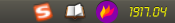
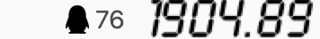

# electron-app-topgo-alarm

> 在任务栏提醒金价的小工具，目前仅显示 `XAU/国际黄金` (单位：美元/盎司） 与 `AUTD/上海黄金延期` （单位：人民币元/每克）价格，实时价格来源于新浪财经。

### Screenshot / 截图

- `Linux Ubuntu` 环境下运行截图:



- `Mac` 环境下运行截图:



### Reference / 参考资料

- [Official/官网](https://www.electronjs.org/)
- [Awesome Electron](https://github.com/sindresorhus/awesome-electron)

### Installation & Usage / 安装与使用

当前操作系统请安装项目目录下 `LcdD.ttf` 字体。

```bash
git clone https://github.com/ycrao/electron-app-topgo-alarm.git
cd electron-app-topgo-alarm
# 安装依赖
npm install
# 本地开发
npm run start
# 编译 mac 二进制文件 [已验证过]
npm run build_mac
# 编译 linux 下二进制文件 [已验证过]
npm run build_linux
# 该命令暂未验证，是否能成功编译出二进制可执行安装文件，有编译成功过或存在问题的可反馈到 issue 中
npm run build_win
# 不建议在 Windows 下编译使用，因为任务栏 Tray 图标太小，不能看清楚，后期统一使用悬浮窗
```


### FAQ / 常见问题

#### 1. 下载依赖缓慢超时

> 可以考虑使用 [淘宝镜像](https://developer.aliyun.com/mirror/NPM?from=tnpm) ，如果还有非 `canvas` 依赖（如`node-sass`）错误，可参考 [安装 node-sass 的正确姿势](https://github.com/lmk123/blog/issues/28) 文章。

```bash
npm install --registry=https://registry.npm.taobao.org
npm install --sass_binary_site=https://npm.taobao.org/mirrors/node-sass/
npm install --canvas_binary_host_mirror=https://npm.taobao.org/mirrors/node-canvas-prebuilt/
...
```

#### 2. `canvas` 依赖编译失败

> 请参考 [官方WIKI文档](https://github.com/Automattic/node-canvas/wiki) 解决，目前本人在 `macOS Mojave` 和 `Ubuntu 16.04 LTS` 系统下编译安装成功。

#### 3. 尝试各种办法都安装编译失败？

> 请下载作者已编译好的二进制文件，目前仅提供 `macOS` 与 `Linux` （仅在 `macOS Mojave` 和 `Ubuntu 16.04 LTS` 环境下经过验证，其它环境请自行验证）操作系统下 [二进制文件](https://github.com/ycrao/electron-app-topgo-alarm/releases) 。